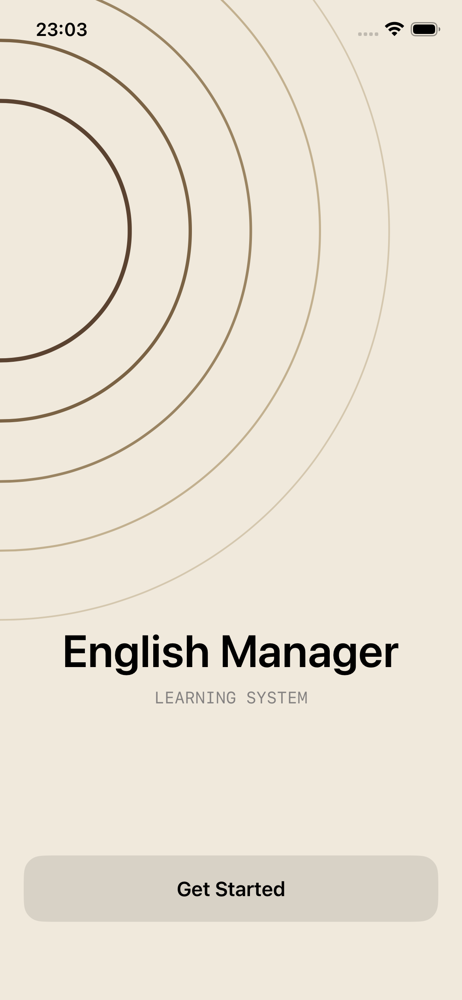
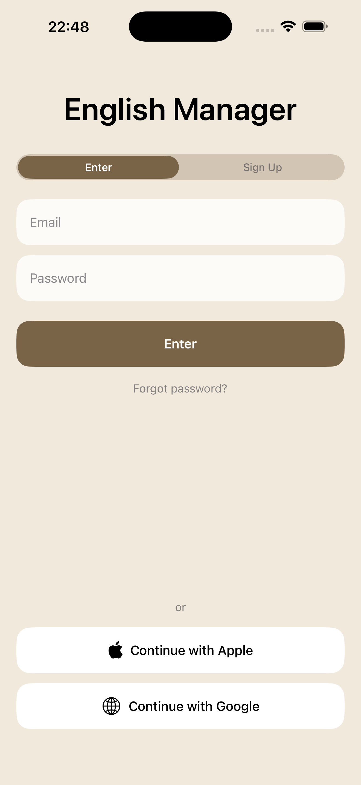
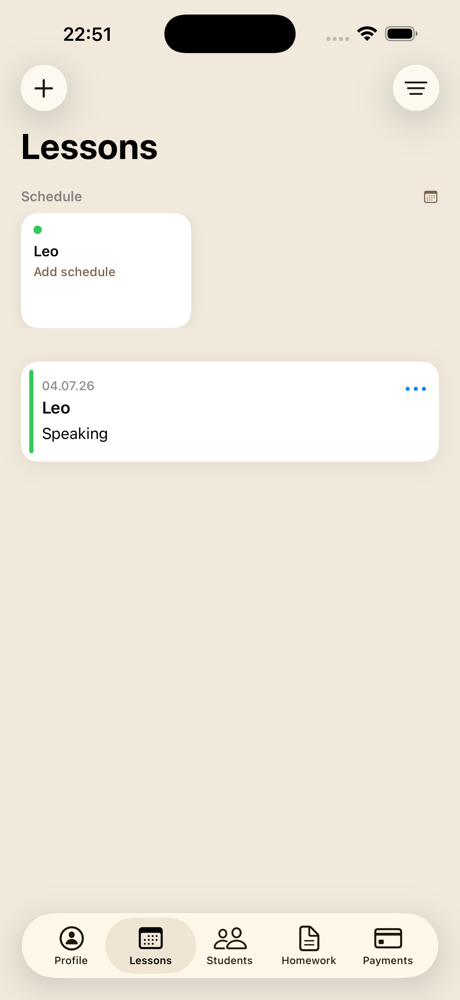
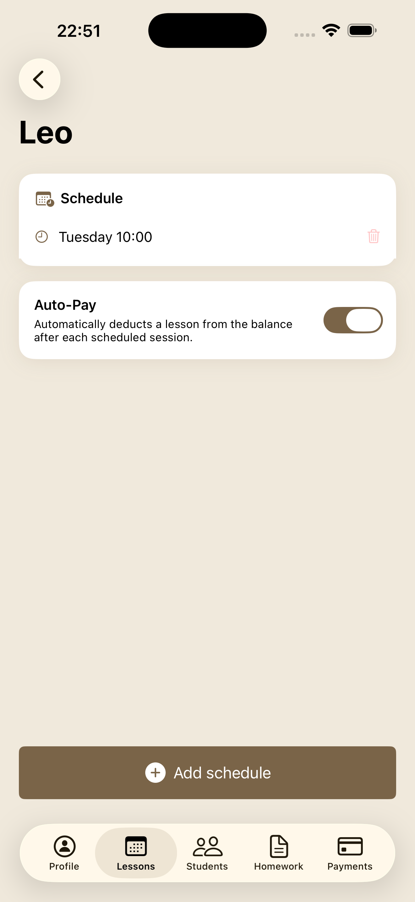
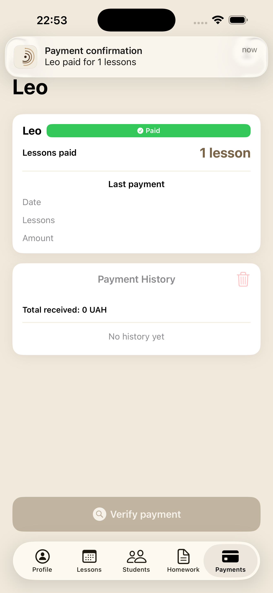
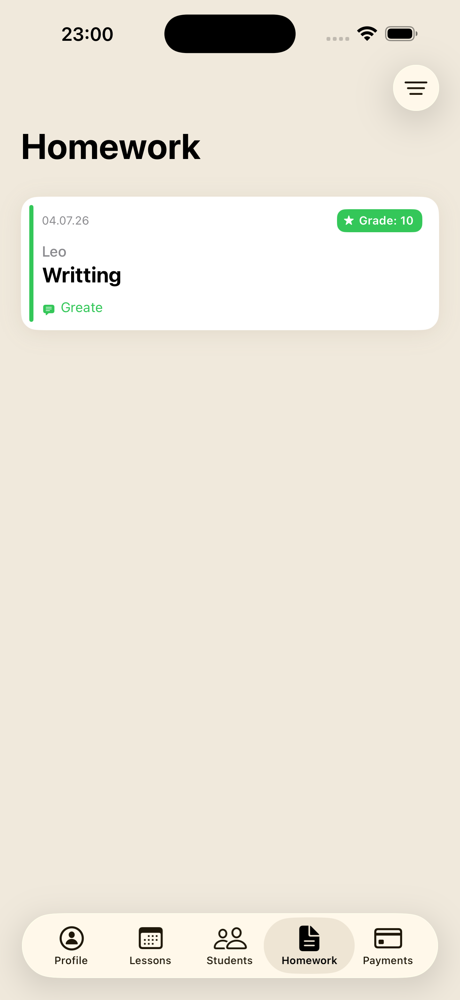
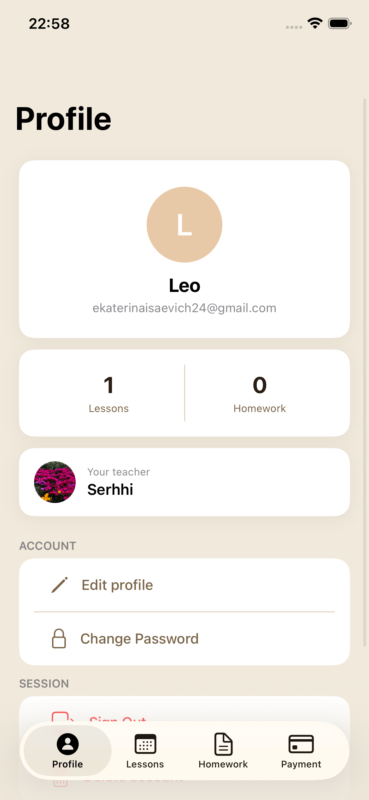
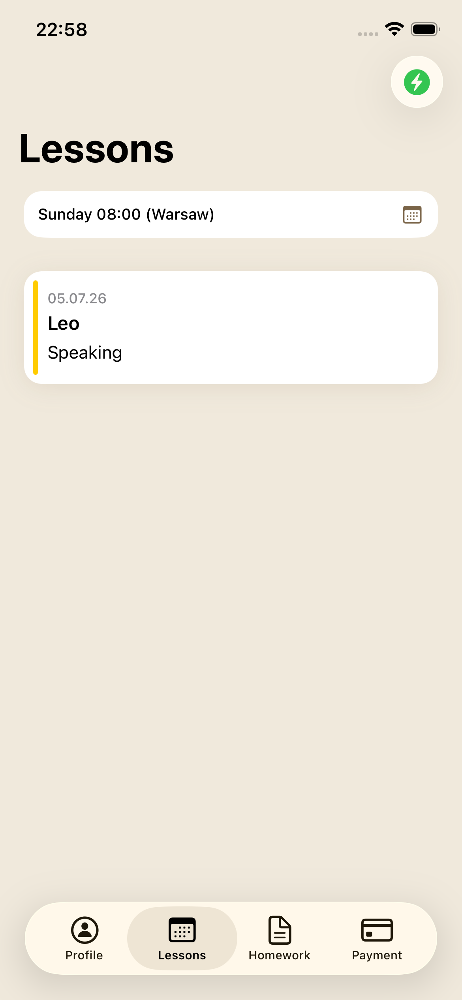
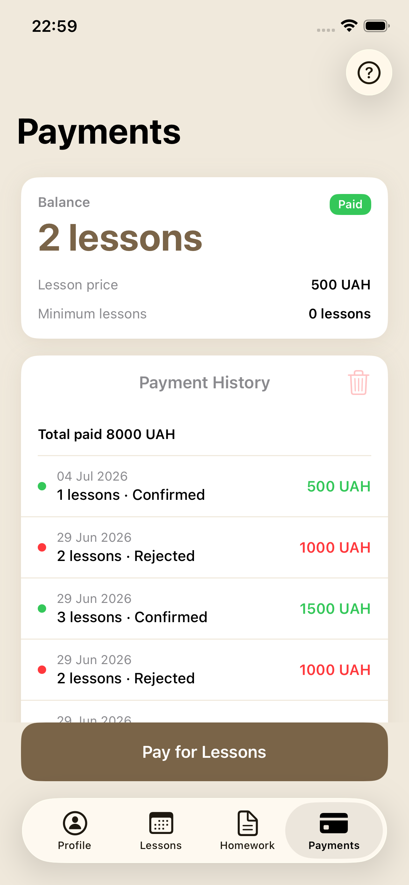
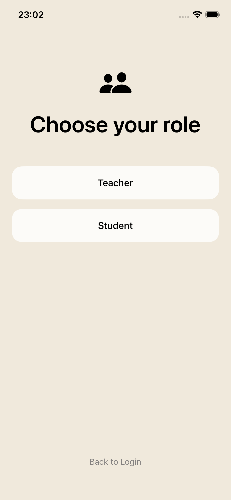

<div align="center">

# English Manager

**Lesson management platform for English teachers and students.**  
Schedule lessons · track homework · manage payments · send push notifications.


</div>

---

## Screenshots

<div align="center">

| Onboarding | Sign In | Teacher · Lessons | Teacher · Schedule |
|:---:|:---:|:---:|:---:|
|  |  |  |  |

| Payment Confirmation | Homework Review | Student · Profile | Student · Lessons |
|:---:|:---:|:---:|:---:|
|  |  |  |  |

| Student · Payments | Role Selection |
|:---:|:---:|
|  |  |

</div>

---

## Features

**Teacher**
- Add students by email, build weekly schedules per student
- Log lessons with topic, materials, source links
- Review & grade homework submissions
- Confirm / reject / edit payment requests, adjust lesson balance

**Student**
- View schedule, lesson history, upcoming sessions
- Submit homework with links, track review status & grade
- Submit payment requests, view payment history
- Auto-debit — balance decrements automatically after each class

**Platform**
- Role-based onboarding (Teacher / Student), separate tab bars
- Push notifications — payment requests, low balance, lesson reminders
- Sign in with Apple · Google · Email/Password
- Light / Dark mode · 🇺🇦 Ukrainian + 🇬🇧 English

---

## Tech Stack

| | |
|---|---|
| Language | Swift 5.9 |
| UI | UIKit · programmatic layout · SnapKit · Compositional Layout |
| Architecture | MVVM + Closures · Router pattern |
| Auth | Firebase Auth (Email · Apple · Google Sign-In) |
| Database | Cloud Firestore |
| Storage | Firebase Storage |
| Serverless | Cloud Functions · Node.js · `luxon` |
| Push | FCM + APNs |
| Images | Kingfisher |
| Crash reporting | Firebase Crashlytics |

---

## Architecture

```
EnglishManager/
├── Models/          # User, Lesson, Homework, PaymentRequest,
│                    # Schedule, LessonOccurrence, TeacherSettings
├── Services/        # Firestore, Auth, Storage, Push, UserCache
├── ViewModels/      # One VM per screen, protocol-first
├── Mappers/         # PaymentStatusMapper, BalanceLevelMapper,
│                    # HomeworkStatusMapper, OccurrenceStatusMapper
├── Formatters/      # SharedDateFormatter, PaymentFormatter,
│                    # LessonFormatter, HomeworkFormatter
├── Routers/         # AuthRouter, TeacherRouter, StudentRouter
├── ViewControllers/ # Bind ViewModel → UI only, no business logic
├── Views/           # AvatarView, StatsCardView, EmptyStateView,
│                    # ToastView, PaymentHistoryView, CellMenuButton
├── Cells/           # LessonCell, HomeworkCell, PaymentCell, StudentCell
└── Extensions/      # UIColor+App, UIView+Card, String+Localization
```

---

## Engineering Highlights

**Firestore batched writes for payment confirmation**  
Confirming a payment atomically updates the payment status and increments `lessonsBalance` via `WriteBatch` + `FieldValue.increment` — no inconsistent state possible.

**In-memory + disk user cache (5 min TTL)**  
`UserCache` serves the current user from memory or `UserDefaults` before touching Firestore, cutting redundant reads on every screen transition — critical for staying on the free tier.

**Timezone-aware push notifications via Cloud Functions**  
Lesson reminders use the teacher's IANA timezone (stored in Firestore, synced on launch with a cached-comparison guard). A `notifiedAt` field on `LessonOccurrence` prevents duplicate sends.

---

## Getting Started

> Requires Xcode 15+, iOS 16.0+ device or simulator.

```bash
git clone https://github.com/<your-username>/english-manager.git
cd english-manager
```

1. Create a Firebase project, download `GoogleService-Info.plist`, place it in the project root.
2. Enable **Email/Password**, **Google**, **Apple** in Firebase Auth.
3. Dependencies resolve automatically via **Swift Package Manager**.
4. Deploy Cloud Functions:
```bash
cd functions && npm install && firebase deploy --only functions
```

---

## Contact

**Serhii Klepikov** — iOS Developer  
[LinkedIn](https://linkedin.com/in/your-profile) · your.email@example.com
